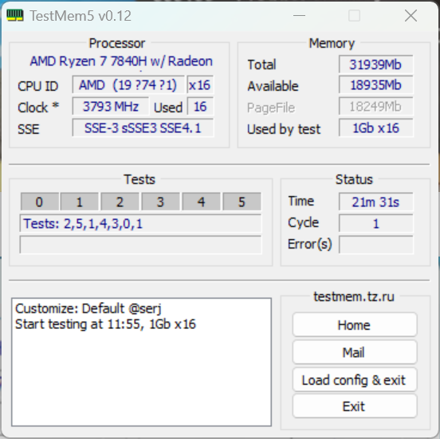
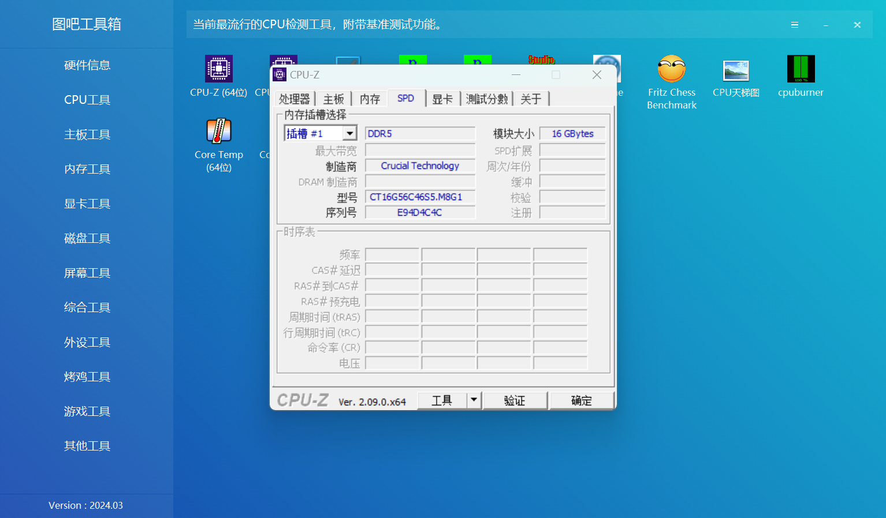
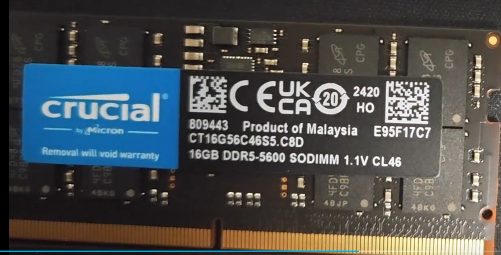
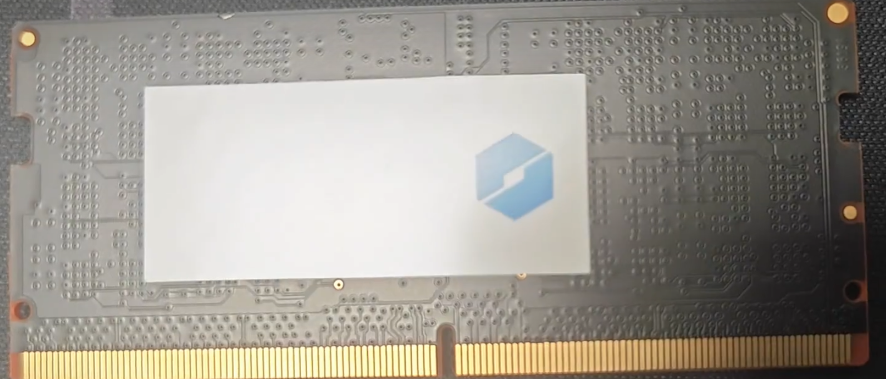

### 正品



### 伪造


[𝑶𝒃𝒔𝒊𝒅𝒊𝒂𝒏 2.0 也许是全网最完整从零开始配置 | 干货分享 | 附下载链接 （划掉23333333_哔哩哔哩_bilibili](https://www.bilibili.com/video/BV1yi4y1d7g4/?vd_source=2bc27ec22a8e739492a12db57107f831)

[chhoumann/MetaEdit: MetaEdit for Obsidian (github.com)](https://github.com/chhoumann/MetaEdit)

D:\ProgramFileTools\Sunshine\tools\dxgi-info.exe
# moonlight拓展屏幕
每次重启电脑，设备编号都会变
[【超详细】iOS/Android设备完美实现电脑副屏——纯软件方案 - 知乎 (zhihu.com)](https://zhuanlan.zhihu.com/p/669124021)


[MiFlash 错误 Not catch checkpoint 解决方法 – MIUI历史版本 (miuiver.com)](https://miuiver.com/miflash-error-not-catch-checkpoint/)

 
# 因占用大量资源 禁用Windows系统对zip文件自动索引预览功能


11:02:00  
发现个问题，双击我的电脑中的盘符或文件夹的时候，系统会自动对文件夹下的zip、cab文件进行自动解析当作文件夹打开目录结构并索引，如果有些zip文件里面的文件非常多（几万、几十万、几百万），则会占用大量资源，这个问题从win7到win11一直存在。

## 1. 解决Windows系统对zip、cab文件自动索引预览功能占用大量资源的方法

### 1.1. 方法一

```
删除注册表将下面两个都删除：
HKEY_CLASSES_ROOT\CLSID\{E88DCCE0-B7B3-11d1-A9F0-00AA0060FA31}
HKEY_CLASSES_ROOT\CLSID\{0CD7A5C0-9F37-11CE-AE65-08002B2E1262}
重启电脑生效。
```

### 1.2. 方法二

```
HKEY_CLASSES_ROOT\CLSID\{E88DCCE0-B7B3-11d1-A9F0-00AA0060FA31}\ShellFolder
HKEY_CLASSES_ROOT\CLSID\{0CD7A5C0-9F37-11CE-AE65-08002B2E1262}\ShellFolder
```

中 Attributes 的值均改为0，重启电脑生效。  
修改不了的话，需要修改权限所属，比较麻烦；可用dism++中的【春哥附体】功能打开 regedit 再进行操作即可。  
它们对应的dll文件分别为：  
%SystemRoot%\system32\zipfldr.dll  
%SystemRoot%\system32\cabview.dll

### 1.3. 未测试的方法

删除注册表项  
[-HKEY_CLASSES_ROOT\CompressedFolder\CLSID]  
[-HKEY_CLASSES_ROOT\SystemFileAssociations\.zip\CLSID]  
cab和zip文件类似，这个方法可能杀伤力有点大吧，未测试。

> 其他参考：  
> 只需取消zipfldr.dll的注册就可以了，点击开始——运行，敲入: regsvr32 /u zipfldr.dll。然后回车即可。  
> 或逐次进入“HKEY_CLASSES_ROOT\CLSID\{E88DCCE0-B7B3-11d1-A9F0-00AA0060FA31}”项，在右侧窗格中可以看到默认的键值为“CompressedFolder”，同样右击执行删除操作，删除该项相当于执行“regsvr32 /u zipfldr.dll”的操作。注册表修改完成后，重新启动系统后就可以生效了。

不过测试的时候报错：  
模块“zipfldr.dll”已加载，但找不到入口点 DllUnregisterServer。  
请确保“zipfldr.dll”为有效的 DLL 或 OCX 文件，然后重试。

更新于:2023-04-06 11:43:10 栏目:[技术技巧](http://blog.dngz.net/category/skill) 关键词:[windows](http://blog.dngz.net/tag/windows/),[win7](http://blog.dngz.net/tag/win7/),[win11](http://blog.dngz.net/tag/win11/),[win10](http://blog.dngz.net/tag/win10/),[自动解析zip](http://blog.dngz.net/tag/%E8%87%AA%E5%8A%A8%E8%A7%A3%E6%9E%90zip/)

本站使用「署名 4.0 国际」创作共享协议，可转载、引用，但需署名作者且注明文章出处

### 1.4. 推荐文章

- [Windows连接Samba共享 登录失败:未知的用户名或错误密码 的解决方法](http://blog.dngz.net/windows-samba-login-failed.htm "Windows连接Samba共享 登录失败:未知的用户名或错误密码 的解决方法")
- [解决User Profile Service服务未能登陆 无法加载用户配置文件](http://blog.dngz.net/UserProfileService.htm "解决User Profile Service服务未能登陆 无法加载用户配置文件")
- [让Windows磁盘清理工具功能更强](http://blog.dngz.net/441.htm "让Windows磁盘清理工具功能更强")
- [计算机属性信息修改方法（OEM信息修改方法）](http://blog.dngz.net/399.htm "计算机属性信息修改方法（OEM信息修改方法）")
- [九招防范黑客保护计算机安全的简单办法](http://blog.dngz.net/393.htm "九招防范黑客保护计算机安全的简单办法")
- [议Google黑客搜索技术](http://blog.dngz.net/296.htm)
- [时间隧道，穿越时空的记忆，由“时光宝箱”计划想起](http://blog.dngz.net/289.htm)
- [2019.6.08周六 高考时间玩实况足球](http://blog.dngz.net/761.htm)
- [Firefox标签页浏览技巧](http://blog.dngz.net/417.htm)
- [我的安卓手机可能被入侵了](http://blog.dngz.net/811.htm)


[【图片】【教程】让你的joycon完美用于pc【switch吧】_百度贴吧 (baidu.com)](https://tieba.baidu.com/p/5601301108?see_lz=1)
打开那个configure vjoy,number of buntton改成32
右侧的应该是体感之类的，关掉也行，不知道开了能不能用。接着应用
点击下面的应用就ok,这时候你的手柄应该会震动一下，然后本来闪的灯不闪了。


日语四级
对赴日留学，工作比较感兴趣
意向：Web开发SSM，嵌入式开发


[《树莓派快速上手》 说明 (itprojects.cn)](https://doc.itprojects.cn/0007.zhishi.raspberrypi/02.doc/index.html#/README)

# 删除图片
1697547094000x4fhb7
16978851760004ndv3l
1697885186000ladvfs
1698479437000f45eif

# 随机变量

  

在我们掷骰子的随机实验中，我们引入了*随机变量*（random variable）的概念。

随机变量几乎可以是任何数量，并且它可以在随机实验的一组可能性中取一个值。

考虑一个随机变量$X$，其值在掷骰子的样本空间$\mathcal{S}=\{1,2,3,4,5,6\}$中。

为了简化符号，一方面，我们可以将$P(X)$表示为随机变量$X$上的*分布*（distribution）

  

我们可以将事件“看到一个$5$”表示为$\{X=5\}$或$X=5$，

其概率表示为$P(\{X=5\})$或$P(X=5)$。

通过$P(X=a)$，我们区分了随机变量$X$和$X$可以采取的值（例如$a$）。

然而，这可能会导致繁琐的表示。

为了简化符号，一方面，我们可以将$P(X)$表示为随机变量$X$上的*分布*（distribution）：

分布告诉我们$X$获得某一值的概率。

另一方面，我们可以简单用$P(a)$表示随机变量取值$a$的概率。

由于概率论中的事件是来自样本空间的一组结果，因此我们可以为随机变量指定值的可取范围。

例如，$P(1 \leq X \leq 3)$表示事件$\{1 \leq X \leq 3\}$，

即$\{X = 1, 2, \text{or}, 3\}$的概率。

等价地，$P(1 \leq X \leq 3)$表示随机变量$X$从$\{1, 2, 3\}$中取值的概率。

  

请注意，*离散*（discrete）随机变量（如骰子的每一面）

和*连续*（continuous）随机变量（如人的体重和身高）之间存在微妙的区别。

现实生活中，测量两个人是否具有完全相同的身高没有太大意义。

如果我们进行足够精确的测量，最终会发现这个星球上没有两个人具有完全相同的身高。

在这种情况下，询问某人的身高是否落入给定的区间，比如是否在1.79米和1.81米之间更有意义。

在这些情况下，我们将这个看到某个数值的可能性量化为*密度*（density）。

高度恰好为1.80米的概率为0，但密度不是0。

在任何两个不同高度之间的区间，我们都有非零的概率。

在本节的其余部分中，我们将考虑离散空间中的概率。

连续随机变量的概率可以参考深度学习数学附录中[随机变量](https://d2l.ai/chapter_appendix-mathematics-for-deep-learning/random-variables.html)

的一节。

  

# 处理多个随机变量

  

很多时候，我们会考虑多个随机变量。

比如，我们可能需要对疾病和症状之间的关系进行建模。

给定一个疾病和一个症状，比如“流感”和“咳嗽”，以某个概率存在或不存在于某个患者身上。

我们需要估计这些概率以及概率之间的关系，以便我们可以运用我们的推断来实现更好的医疗服务。

  

再举一个更复杂的例子：图像包含数百万像素，因此有数百万个随机变量。

在许多情况下，图像会附带一个*标签*（label），标识图像中的对象。

我们也可以将标签视为一个随机变量。

我们甚至可以将所有元数据视为随机变量，例如位置、时间、光圈、焦距、ISO、对焦距离和相机类型。

所有这些都是联合发生的随机变量。

当我们处理多个随机变量时，会有若干个变量是我们感兴趣的。


```yaml
  - "DOMAIN-SUFFIX,raisei.online,DIRECT"
```

r7000p\27189 S-1-5-21-3252757942-1439868350-1922429107-1001
```text
mklink /d C:\Users\27189 C:\Users\Raisei
```

网上都是在制造焦虑，实际上根本没那么严重，我普通二本，一年经验，北京面了3家，拿了4个offer，最高32k，最低27k，32k是外包，还有个30k的自研可以考虑一下，不说了，明天还要两个面试，寒冬年年有，年年都是计算机，结果计算机工资不是还是轻轻松松月入过2w， xdm，有一说一，现在不学JAVA，以后就没机会了，趁着现在的红利，狠狠的赚一笔


Dism /Online /Cleanup-Image /ScanHealth
Dism /Online /Cleanup-Image /CheckHealth
DISM /Online /Cleanup-image /RestoreHealth
sfc /SCANNOW


 +exec main_control.cfg
 銀河最速伝説と重傷倒地！馬文馬太郎です


查看日志：
tailf /var/log/messages

爬虫工具
https://gitee.com/ssssssss-team/spider-flow.git

GraphQL：一种新兴的API查询语言，可以更加高效地获取数据，


